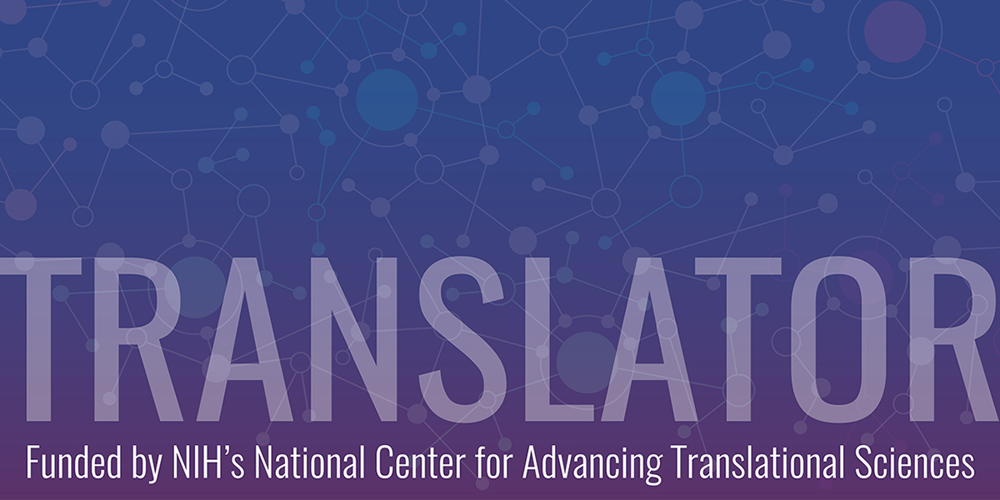

# Tutorials

1. [Biolink Model](https://biolink.github.io/biolink-model/working-with-the-model/)
1. [Implementing TRAPI](https://github.com/NCATSTranslator/ReasonerAPI/tree/master/ImplementationGuidance)
1. [Registering a TRAPI service](../../architecture/registry.md#adding-an-api-to-the-translator-smartapi-registry)
1. [[Workflows]]

# Purpose of this page (work-in-progress)

- Brainstorm outline all the specific necessary technical and sociological steps required to "plug into" the Translator ecosystem?
- Add link outs to videos (existing?) for various stuff

## Additional Tutorial topics for composition?

1. KP-starter kit
1. Standing Up a KP/ARA
1. Workflow runner (video)
